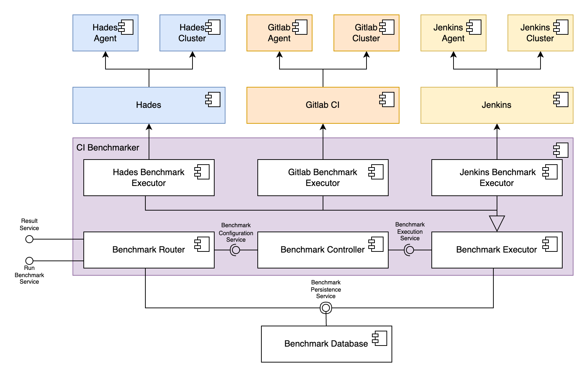

# CI-Benchmarker

A measurement instrument for comparing CI job-execution variants (Hades with a
Docker executor, Hades with a Kubernetes executor, Jenkins). A load generator VM
drives the systems under test and records, per job, exactly when it was
submitted and exactly when its completion was observed.

Every number that ends up in a paper comes from this tool, so the design is
organised around measurement validity rather than convenience.

## How a measurement is made

```
  benchmarker                                  system under test
  ───────────                                  ─────────────────
  submit_time_ns  ────  POST job  ───────────▶  accepts, returns job id
  submit_ack_time_ns ◀──────────────────────────
                                                 ... job queues and runs ...
  received_time_ns ◀───  POST /v1/callback  ───  terminal status
```

Pure REST in both directions:

* The benchmarker POSTs a job to the system under test.
* The system under test POSTs a terminal-status callback back.

Completion is **observed, never inferred**. There is no polling, and nothing
depends on the workload calling home from inside a step container. Both
endpoints of every measured interval are read from the benchmarker's own clock,
so no clock synchronisation between hosts is required.

Two callback shapes are accepted at the one endpoint and normalised:

| Source | Shape | Job id location |
| --- | --- | --- |
| Hades status webhook | flat object, `event` + `job_id` + `status` | `job_id` |
| Jenkins post-build notification | nested under `build` | `build.parameters.HADES_UUID` |

The receiver is **idempotent by job id**. This is not defensive
over-engineering: Hades delivers at-least-once from a JetStream durable
consumer and retries any non-2xx, and the Jenkins notification plugin fires
twice per build (phase `COMPLETED` and again `FINALIZED`). The first terminal
callback establishes `received_time_ns`; later ones only bump a counter.

A failed database write is answered with 503 precisely so that at-least-once
delivery redelivers the measurement instead of losing it.

## Schema

All timestamps are **epoch nanoseconds stored as INTEGER**. Every derived
duration is an exact `int64` subtraction, which removes `strftime('%s')` second
flooring, RFC3339 fractional-second truncation and text-parsing ambiguity in
one step.

| Table | One row per | Purpose |
| --- | --- | --- |
| `benchmark_run` | benchmark invocation | provenance: variant, target host, workload, config fingerprint, pacing, version |
| `job_submission` | submission **attempt** | `submit_time_ns` / `submit_ack_time_ns`, priority, and failures recorded explicitly |
| `job_callback` | job | the authoritative terminal observation, idempotent by `job_id` |
| `job_event` | callback POST | append-only audit of every delivery, including duplicates and unparseable bodies |
| `scheduled_job`, `job_results` | — | **deprecated**, backs the old endpoints only |

`job_submission.run_id` references `benchmark_run(run_id)`. `job_callback`
deliberately has **no** foreign key to `job_submission`: a callback must never
be rejected, it can legitimately arrive before its own submission row commits,
and an unmatched callback is itself a finding. Matching is a `LEFT JOIN` at
export time, and `GET /v1/export/callbacks?only_unmatched=true` lists the
orphans.

Priority is captured client-side at submit time because the Hades callback does
not carry it and it cannot be recovered afterwards.

### Migrations

`persister/migrations/NNNN_name.sql`, applied in order, each in its own
transaction together with its `schema_migrations` row. Add a file; do not edit
an applied one.

The previous bootstrap ran a single `schema.sql` of `CREATE TABLE IF NOT EXISTS`
statements, which silently did nothing against a database that already had the
tables - so no schema change could ever reach a deployed instance.

`persister/schema.sql` now exists only as the input sqlc needs to generate the
legacy query code. It is not what creates the database.

## Endpoints

### Measurement

| Method | Path | Purpose |
| --- | --- | --- |
| POST | `/v1/callback` | terminal status receiver (Hades and Jenkins) |
| POST | `/v1/benchmark/hades-docker` | run against Hades + Docker |
| POST | `/v1/benchmark/hades-k8s` | run against Hades + Kubernetes |
| POST | `/v1/benchmark/jenkins` | run against Jenkins |

Common query parameters: `count`, `concurrency`, `rate`, `run_id`,
`workload_id`, `commit_hash`, `notes`.

### Export

| Method | Path | Purpose |
| --- | --- | --- |
| GET | `/v1/export/jobs?run_id=…&format=jsonl\|csv` | raw per-job rows |
| GET | `/v1/export/callbacks?run_id=…&only_unmatched=` | raw callbacks and orphans |
| GET | `/v1/export/runs` | recorded runs and their provenance |
| GET | `/v1/healthz` | status and applied schema version |

**All analysis and every figure is generated from `/v1/export/jobs`.**
Statistics live in the analysis scripts, not in the tool.

### Deprecated

`POST /v1/start_time`, `POST /v1/result` and the `/v1/benchmark/*/metrics` and
`/v1/benchmark/*/histogram` endpoints still respond, and still write to and read
from the legacy tables, so existing dashboards keep working. They must not be
used for published numbers - see the doc comments in
`MetricsController/metrics-controller.go` for why.

## Load generation

Every executor uses one shared HTTP client configuration (identical timeout,
dial timeout and connection pooling), and concurrency is shaped by the benchmark
controller rather than by each executor's connection limits. A comparison
between variants is only meaningful if the offered load is the same.

`rate` drives an **open-loop** pacer: release times come from a fixed schedule
rather than from when the previous submission finished, so a slow system under
test cannot slow the offered load and hide its own queueing (coordinated
omission).

`HTTP_MAX_CONNS_PER_HOST` defaults to `0`, meaning unlimited, and should stay
there. A hard cap makes submission N+1 block for a free connection, and that
wait counts against the client timeout, so it both throttles the load and
manufactures submission failures.

## Adding a variant

Implement `executor.Executor` (`Execute`, `Name`, `Variant`, `TargetHost`) and
register a route. Nothing in the measurement path needs to know which variant it
is driving.

## Running an experiment

```bash
RUN_ID=$(uuidgen)

curl -X POST "https://$BENCHMARKER/v1/benchmark/hades-docker?\
host=https://sut-docker.example/api/v1/build&count=400&concurrency=64&\
run_id=$RUN_ID&workload_id=java-build" \
  -H 'Content-Type: application/json' -d @workload.json

# wait for callbacks to land, then
curl "https://$BENCHMARKER/v1/export/jobs?run_id=$RUN_ID&format=csv" > run.csv

# always check for callbacks that never matched a submission
curl "https://$BENCHMARKER/v1/export/callbacks?run_id=$RUN_ID&only_unmatched=true"
```

The benchmark endpoint returns once every job has been **submitted**; jobs are
still running at that point. `submitted_jobs + failed_jobs == requested_jobs`
always, so denominators are recoverable.

Use the [Bruno](https://www.usebruno.com/) examples in [`bruno/`](./bruno) to
exercise the endpoints by hand.

## Deployment

```bash
cp .env.example .env      # set BENCHMARKER_HOST, CALLBACK_BASE_URL, BENCHMARKER_IMAGE_TAG
touch traefik/acme.json && chmod 600 traefik/acme.json
docker compose up -d
```

The database lives in the `benchmark-data` volume rather than in the container
filesystem, so `--force-recreate` cannot destroy a collected dataset, and the
container drains queued writes on SIGTERM. The compose file runs a pinned image;
there is deliberately no `build: .`, so a redeploy cannot silently swap in
whatever is in the working tree. `BENCHMARKER_IMAGE_TAG` has no default and
compose refuses to start without it, so a campaign cannot accidentally run a
moving `latest`.

## Development

```bash
DEBUG=true go run .
```

### Checks

These are exactly what CI runs; the image build is gated on them passing. The
race detector is not optional here - it is what covers the callback storm tests.

```bash
unformatted=$(gofmt -l .)
test -z "$unformatted"
go vet ./...
CGO_ENABLED=1 go test -race -timeout 15m ./...
```

`go test -short ./...` skips the larger headroom storm when iterating locally.

### Regenerating the OpenAPI spec

```bash
go install github.com/swaggo/swag/cmd/swag@latest
swag init --parseDependency --parseInternal -g main.go -o docs
```

### Regenerating the legacy DB code

Only needed when changing `persister/query.sql`, which covers the deprecated
tables. New code uses hand-written SQL in `persister/measurement.go`.

```bash
cd persister && sqlc generate
```

## Architecture diagram


